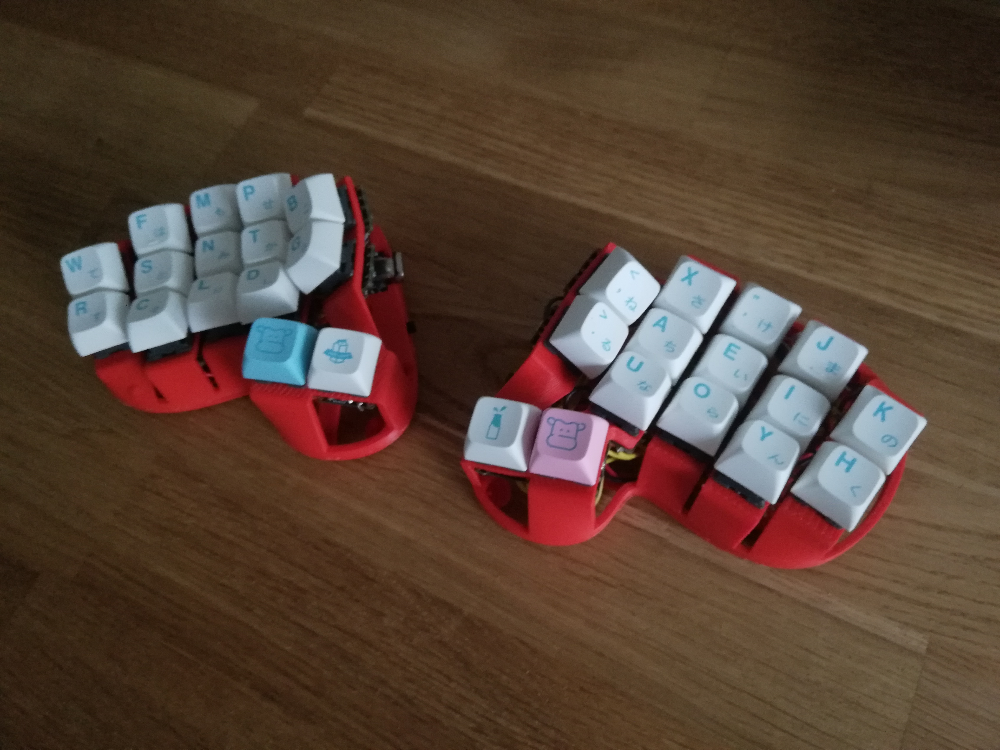

# Rommana
A 30 key well powered by Xioa BLE

### Parts
- MCU: 2x Seeeduino Xiao BLE
- On/Off Switch: 2x SS12 °F15 3 Pin On/On Mini Slide Switch
- Reset button: 2x 2 Pin DIP 6 x 6 x 5
- 30 MX switches
- Optional:
  - Ameoba PCBS
  - MX Hotswap sockets

## Pictures

## Build logs
- A hand wire by Rafael Romao: [Build Log](https://github.com/rafaelromao/keyboards/blob/main/docs/rommana.md)

## Credits and references
This keyboard wouldn't be possible without the help and videos of [Quentin](https://github.com/bstiq) of [BastardKB](https://bastardkb.com)
